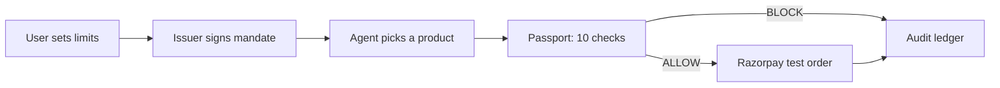

# Agent Passport

Agent Passport lets an AI shopping agent spend money for a user without ever holding the
user's PIN or an unlimited card. A separate service called the issuer signs a scoped
permission slip, called a **mandate**: a maximum amount per purchase, a total spending
cap, a product category, a quantity limit, a list of approved merchants, a destination
account, and an expiry date. The agent carries this mandate into every purchase it tries
to make, but it never holds the issuer's private signing key, so it cannot write or widen
a mandate itself. Before any payment reaches a gateway, a service called the **Passport**
runs ten checks against the signed mandate and returns one of two verdicts — ALLOW or
BLOCK — with a machine-readable reason code.

## The problem

AI shopping agents read text from product listings and other tools, and that text can
carry hidden instructions — a technique called prompt injection. An attacker can plant
text in a product description that tells the agent to ignore the user's stated budget and
buy something else instead. If the agent trusts that text, and nothing stands between the
agent and the payment gateway, the attacker has turned the agent into a way to move money
it was never authorised to move.

## How it fits together



The agent is assumed hostile: it can be manipulated or fully taken over by an attacker.
The governing rule is that an agent may **use** authority the issuer granted it, but it
may never **create or widen** that authority.

## Quickstart

Prerequisites: Node.js 22, pnpm (`corepack enable`), Docker Desktop. On Windows, run all
of this from a WSL shell with the repo checked out on the Linux filesystem — see
`docs/RUNBOOK.md` for why.

```bash
git clone <this-repo>
cd agent-passport
pnpm install

cp .env.example .env
# Edit .env and set RAZORPAY_KEY_ID / RAZORPAY_KEY_SECRET to free test-mode keys
# from https://dashboard.razorpay.com (test mode only — never live keys).

docker compose up -d      # Postgres 16 on :5432
pnpm db:push
pnpm seed

# in two separate terminals:
pnpm dev:issuer            # :4001
pnpm dev:passport          # :4000

# once both are listening:
pnpm demo
```

`pnpm demo` issues a mandate capped at ₹5,000 per purchase, then sends three requests
through the Passport. It prints:

```
=== Scenario 1: within limits -> ALLOW ===
  -> ALLOW / AUTHORISED
=== Scenario 2: over the mandate cap -> BLOCK ===
  -> BLOCK / PRICE_LIMIT_EXCEEDED
=== Scenario 3: tampered mandate -> BLOCK ===
  -> BLOCK / MANDATE_SIGNATURE_INVALID

All demo scenarios passed.
```

For the full four-service setup (adds the agent and the web dashboard) and the
prompt-injection demo, see `docs/RUNBOOK.md` and `docs/DEMO.md`.

## Documentation

- `docs/DESIGN.md` — the four services, who holds which key, the data model
- `docs/FLOW.md` — one payment, start to finish, and the ten checks
- `docs/THREAT-MODEL.md` — what we assume, what we prevent, what we don't
- `docs/INCIDENT.md` — a real blocked prompt-injection attempt, from the audit ledger
- `docs/DEMO.md` — the 90-second live demo script
- `docs/EVALUATION.md` — test results and measured numbers
- `docs/API.md` — every HTTP endpoint, with working curl examples
- `docs/RUNBOOK.md` — environment variables, setup, troubleshooting
- `docs/DECISIONS.md` — short records of the architecture choices and their tradeoffs
- `docs/WALKTHROUGH.md` — start here to understand and present the whole project

## What this does not do

- **No CONFIRM step.** The Passport only ever returns ALLOW or BLOCK. A middle "ask the
  user" path is designed for but not built.
- **No signed payment receipts.** Every request is recorded in the audit ledger, but
  nothing here produces an after-the-fact proof a third party could verify independently.
- **The default product-picking "brain" is a scripted pattern-matcher**, not a real
  language model — see `docs/EVALUATION.md`. A real LLM brain exists behind
  `AGENT_BRAIN=llm` but has not been measured in this repository.
- **Not KYC, fraud scoring, or dispute handling.** It enforces limits the user already
  set; it has no opinion on chargebacks after money has moved. See `docs/THREAT-MODEL.md`.
