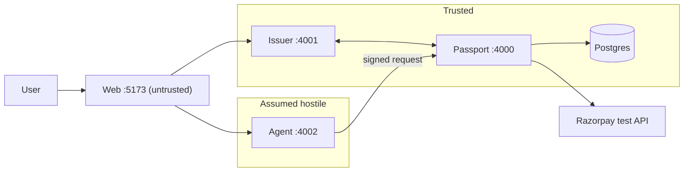

**What this is:** how Agent Passport is put together — the four services, who holds which
cryptographic key, and the shape of the data.
**Who it's for:** an engineer about to read or modify the code.
**Read this if:** you need to know which process can do what before you change anything.

## The four roles

Four separate actors, each with one job:

1. **The user** authorises. They decide the maximum amount, the total cap, the category,
   the merchants, and the expiry — the actual limits of the mandate.
2. **The issuer** grants. It is the only thing that can turn a set of limits into a signed
   mandate. It holds the one private key that makes a mandate genuine.
3. **The agent** uses. It reads a mandate, picks a product, and signs a request. It never
   holds the issuer's key, so it can carry authority but cannot create or widen it.
4. **The Passport** enforces. It runs eleven checks against the signed mandate before any
   payment reaches a gateway, and refuses anything that fails.

A **mandate** is the signed permission slip itself: max amount, cumulative cap, category,
quantity, merchant allow-list, destination, expiry. A **nonce** is a random, single-use
value attached to every request so the same signed request can't be replayed for a second
payment. **Ed25519** is the signature algorithm used everywhere here — a private key
signs, the matching public key verifies, and nobody but the holder of the private key can
produce a valid signature. **Canonical serialisation** means turning an object into bytes
one exact way (sorted keys, no floats, no extra whitespace) so signing and verifying the
same object always produce the same bytes — see `packages/shared/src/canonical.ts`.

## Services

| Service | Port | Holds | Trust |
|---|---|---|---|
| `apps/issuer` | 4001 | issuer Ed25519 private key | trusted |
| `apps/passport` | 4000 | issuer public key, agent public keys, Razorpay credentials, DB | trusted |
| `apps/agent` | 4002 | its own Ed25519 private key only | **assumed hostile** |
| `apps/web` | 5173 | nothing | untrusted |

"Assumed hostile" is not a figure of speech: the agent reads free text from product
catalogs, and that text can carry hidden instructions (prompt injection). The design
assumes an attacker can fully control what the agent decides to request, and asks whether
the system still holds up. `apps/web` renders whatever the trusted services return over a
same-origin proxy (see `apps/web/vite.config.ts`) and never talks to Razorpay or Postgres.

## Key custody

| Key / credential | Who has it | Who must never have it |
|---|---|---|
| Issuer Ed25519 private key | `apps/issuer` only | passport, agent, web |
| Issuer Ed25519 public key | `apps/passport` (fetched at boot from `GET /public-key`) | — (not secret) |
| Each agent's Ed25519 private key | that one `apps/agent` process only | passport, issuer, web |
| Registered agent public keys | `apps/passport` (via `POST /agents/register`) | — (not secret) |
| Razorpay `RAZORPAY_KEY_ID` / `RAZORPAY_KEY_SECRET` | `apps/passport` only | **agent, web — always** |
| `DATABASE_URL` | `apps/issuer`, `apps/passport` | agent, web |

The Razorpay row is the one that matters most: if the agent process could ever reach the
payment gateway directly, the whole design is broken, because the eleven checks would be
optional rather than mandatory. The agent can only ever ask the Passport to authorize a
request; it has no code path to Razorpay at all.

## Why the issuer is a separate process

The issuer could have been a function inside the Passport. It isn't, on purpose. If
mandate signing and mandate enforcement shared one process, a bug or compromise in the
enforcement code — the part that talks to an assumed-hostile agent's requests all day —
would sit in the same memory space as the one key that can mint new authority. Keeping
them as separate processes with separate key material means the issuer's attack surface
is tiny (issue a mandate, revoke a mandate) and mostly offline: it only has to be reachable
when a user is setting up or changing a mandate, not on every purchase attempt. It also
means the issuer's key can move to a hardware security module or a separate host later
without changing anything about how the Passport verifies signatures.

## Trust boundary

The arrow from the agent to the Passport is the only path a manipulated agent has toward
money. Everything the Passport does after that arrow is what this project is actually
testing.

## Data model

Eight Prisma tables (`prisma/schema.prisma`), one line each:

- **User** — one row per person who owns agents and mandates.
- **Agent** — one row per registered agent identity: its public key and owning user.
- **Mandate** — the signed permission itself: limits, allow-list, destination, expiry,
  and a `revoked` flag.
- **Transaction** — one row per authorize attempt, allowed or blocked, replays included.
- **SpendLedger** — per-mandate rolling-window counters: `spentPaise`, `reservedPaise`,
  `capPaise`.
- **Reservation** — one row per check-10 hold on the ledger, `RESERVED` / `COMMITTED` /
  `RELEASED`.
- **AuditEvent** — the append-only record of every authorize decision.
- **UsedNonce** — every nonce ever accepted, with a unique constraint, for replay
  protection.

## Decisions we made and why

- **Integer paise, never floats.** `amountPaise`, `maxAmountPaise`, and every other money
  field are whole numbers of paise. A check like `amountPaise <= maxAmountPaise` never
  touches floating-point rounding.
- **No Redis.** Nonce replay and the spend cap both live in Postgres — one unique
  constraint, one atomic conditional `UPDATE` — so there is one datastore that is always
  the source of truth, not two that can drift apart.
- **No LLM inside the check pipeline.** None of the eleven checks call a model, fetch a URL,
  or read free text. A check is a pure function over two already-parsed, already-verified
  objects. Its answer can't be steered by more injected text, because it never reads any.
- **A unique index for the nonce**, not a Set in memory or a `SELECT` then `INSERT`. The
  database itself rejects a duplicate nonce; there is no window where two concurrent
  requests both pass a check they should have failed.
- **An atomic conditional `UPDATE` for the spend cap**, not read-then-decide-then-write.
  `reserve()` in `apps/passport/src/ledger.ts` is one `UPDATE ... WHERE spent + reserved +
  amount <= cap`, so two concurrent requests against the same mandate serialize on that
  row's own lock instead of racing.
