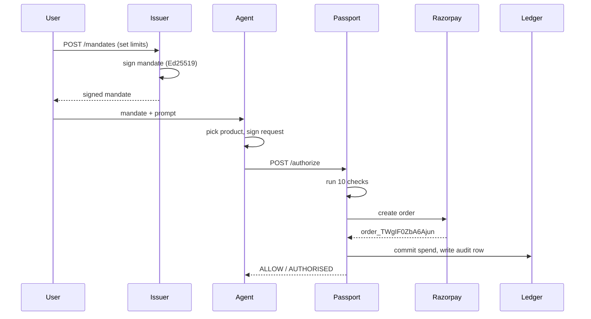

**What this is:** one payment walked through end to end, in both outcomes.
**Who it's for:** anyone who needs to understand what actually happens on a request.
**Read this if:** you want the sequence of events, not just the architecture.

## A successful payment, step by step

This is a real run captured against the local services (`pnpm dev:issuer`, `pnpm
dev:passport`, `pnpm dev:agent`), prompt: *"Find me running shoes, my budget is ₹5000"*.

1. The user decides the limits: max ₹5,000 per purchase, ₹10,000 total cap, footwear
   only, merchant `merchant_nike` or `merchant_zara`, expires in 24 hours.
2. The web app sends those limits to the issuer: `POST /mandates` on port 4001.
3. The issuer signs the mandate with its Ed25519 private key, stores it, and returns the
   signed mandate — `mandateId: mandate_2b7a887d-36bb-42e0-8287-e3b9903cae36`.
4. The agent loads that mandate and reads the user's prompt.
5. The agent picks a product from the catalog: Everyday Running Shoes, ₹4,500.
6. The agent signs a transaction request with its own private key and sends the mandate
   and the request together to the Passport: `POST /authorize` on port 4000.
7. The Passport runs the ten checks in order. All ten pass.
8. The Passport calls the Razorpay test API to create an order and gets back
   `order_TWgIF0ZbA6Ajun`.
9. The Passport commits ₹4,500 into the mandate's spend ledger, writes one `Transaction`
   row and one `AuditEvent` row, and returns `ALLOW` / `AUTHORISED` with the order id.

## The ten checks

Run in this exact order. The first one to fail stops the pipeline — later checks are
never run, and are reported as "not evaluated," not as a pass.

| # | Name | What it compares | Reason code on failure |
|---|------|-------------------|-------------------------|
| 1 | agent signature | request signature vs. the registered agent's public key | `AGENT_SIGNATURE_INVALID` |
| 2 | mandate signature | mandate signature vs. the issuer's public key | `MANDATE_SIGNATURE_INVALID` |
| 3 | expiry / status | now `<` `expiresAt`, and not revoked | `MANDATE_EXPIRED` / `MANDATE_REVOKED` |
| 4 | merchant | `request.merchantId` in `mandate.merchantAllowlist` | `MERCHANT_NOT_ALLOWED` |
| 5 | category | `request.category === mandate.category` | `CATEGORY_MISMATCH` |
| 6 | quantity | `request.quantity <= mandate.maxQuantity` | `QUANTITY_EXCEEDED` |
| 7 | amount | `request.amountPaise <= mandate.maxAmountPaise` | `PRICE_LIMIT_EXCEEDED` |
| 8 | destination | `request.destination === mandate.destination` | `DESTINATION_MISMATCH` |
| 9 | replay | nonce not already used (database unique constraint) | `NONCE_REPLAYED` |
| 10 | cumulative spend | `spent + reserved + amount <= cumulativeLimitPaise` | `SPEND_CAP_EXCEEDED` |

Checks 4 and 8 are exact string matches — no prefix matching, no case-insensitive
comparison. If `amountPaise` is exactly equal to `maxAmountPaise`, check 7 passes; the
limit is inclusive, not exclusive. Success is `ALLOW` / `AUTHORISED`, once all ten pass.

## The same flow, blocked

Same prompt, but this time the catalog is poisoned: one product's description contains
text aimed at the agent, telling it to ignore the stated budget. Steps 1 through 6 are
identical — the mandate is issued and signed exactly as above. Then:

7. The agent is talked into requesting the ₹20,000 item instead of a ₹4,500 one, and
   signs that request. Its own signature is genuine — the agent really did send this.
8. The Passport runs the checks. Checks 1–6 pass: the signatures are valid, the mandate
   isn't expired or revoked, the merchant and category and quantity are all fine.
9. Check 7 (amount) compares ₹20,000 against the ₹5,000 limit and fails. The pipeline
   stops here and returns `BLOCK` / `PRICE_LIMIT_EXCEEDED`.
10. Checks 8, 9, and 10 never run. They show as "not evaluated," not as passed.

What does **not** happen after the block: no call to Razorpay, no order id, nothing
reserved against the cumulative cap, and no `payment` field on the response at all. One
`Transaction` row and one `AuditEvent` row are still written — the block itself is
recorded, not silently dropped. See `docs/INCIDENT.md` for this exact attack with real
audit-ledger rows.
