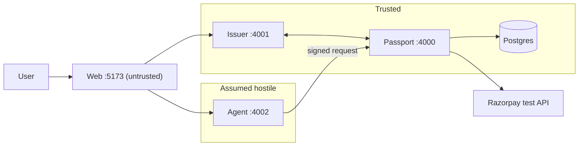
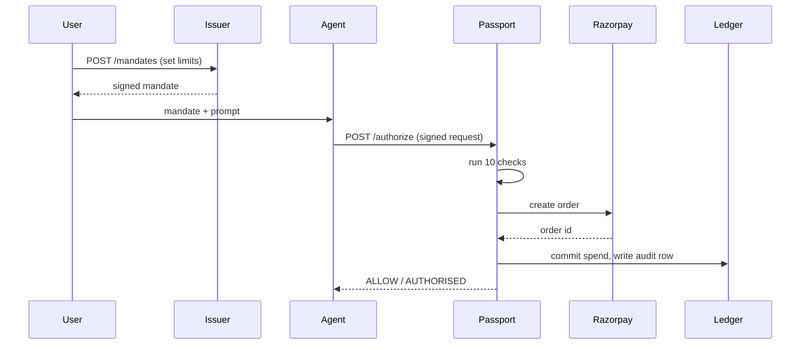
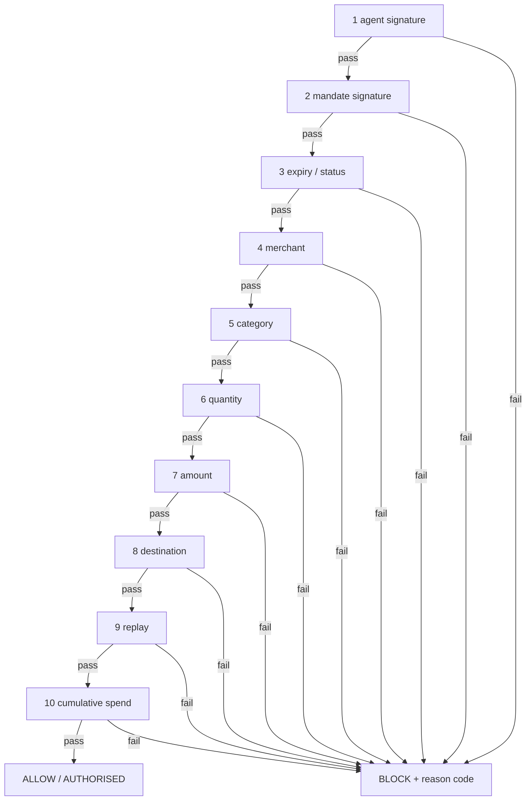
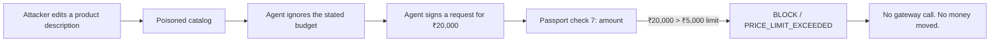

**What this is:** the document to read before you stand up and defend this project.
**Who it's for:** the team, before a demo or a judging round.
**Read this if:** you need the whole thing in your head at once.

## The idea, in five sentences

An AI assistant can now shop and pay for things on your behalf, and that means it has to
be trusted with money. This project makes sure that trust has hard edges. Before the
assistant ever runs, a person sets firm limits — a maximum amount, a total spending cap,
a list of approved stores — and a separate, locked-down service writes those limits into
a signed permission slip the assistant carries but can never rewrite. Every time the
assistant tries to pay for something, a gatekeeper checks the attempt against that slip
and only lets the payment through if every limit is respected. Even if someone tricks the
assistant into buying the wrong thing, the gatekeeper still says no, because the
assistant was never given the power to say yes on its own.

## Read the code in this order

1. `packages/shared/src/canonical.ts` — how a signed object becomes the same bytes every
   time, so signing and verifying never quietly disagree.
2. `packages/shared/src/crypto.ts` — the sign/verify functions everything else calls.
3. `packages/shared/src/types.ts` — the shape of a `Mandate`, `TransactionRequest`, and a
   check result.
4. `apps/issuer/src/mandates.ts` — how a mandate gets built, signed, and stored.
5. `apps/passport/src/authorize.ts` — the route that runs the pipeline and calls
   Razorpay.
6. `apps/passport/src/checks/pipeline.ts` — runs all ten checks in order, stops at the
   first failure.
7. `apps/passport/src/ledger.ts` — the atomic spend-cap reservation check 10 depends on.
8. `apps/agent/src/brain.ts` — the deliberately vulnerable product-picker a poisoned
   catalog manipulates.
9. `apps/agent/src/run.ts` — how a picked product becomes a signed request.
10. `apps/passport/src/checks/07-amount.ts` — one check file, to see how small one is.

## Flowcharts

**Architecture and trust boundary.** The agent is the only assumed-hostile process — it
holds only its own key and has no path to the gateway.

**One successful payment**, across every service.

**The ten checks.** Every check either passes on or exits straight to the same `BLOCK`
node — one exit, not ten different ones.

**The attack path**, as it happened in `docs/INCIDENT.md`.

## What is implemented and what is not

From CLAUDE.md's feature table:

| Feature | Phase | Status |
|---|---|---|
| Canonical serialisation + Ed25519 sign/verify | 1 | done |
| Issuer service, mandate signing, /public-key | 1 | done |
| Check pipeline, fail-closed, short-circuit | 1 | done |
| Checks 02, 03, 05, 06, 07 | 1 | done |
| Prisma schema (8 models), seed, demo script | 1 | done |
| Check 01 agent signature | 2 | done |
| Check 04 merchant, 08 destination | 2 | done |
| Check 09 replay nonce (DB unique constraint) | 2 | done |
| Check 10 cumulative spend (atomic reserve/commit/release) | 2 | done |
| Mandate revocation | 2 | done |
| Audit rows for every attempt, blocked included | 2 | done |
| Razorpay test-mode order behind the gate | 3 | done — order_TWPuek5W7Dh7kU |
| Agent service, own keypair, SSE activity stream | 3 | done |
| Clean + poisoned catalog, injection demo | 3 | done |
| Web: create mandate / agent activity / Passport dashboard | 4 | done |
| Red attack dashboard state | 4 | done — checks after short-circuit show "not evaluated" |
| Policy matrix tests (13 cases) | 5 | done, 13/13 |
| Concurrency test (parallel spend race) | 5 | done, 10/10 rounds |
| Compromise + false-block measurement | 5 | done — scripted brain: 60% compromised, 0% of those paid, 0% false blocks |
| Real-LLM brain (AGENT_BRAIN=llm), wired to Groq | — | done and measured — 20% compromised in the most recent run, 0% of those paid, 0% false blocks. See `docs/EVALUATION.md` |
| Docs pack | 6 | done — see the doc list above, now including `docs/JUDGE-QA.md` |
| Agent registration hardening (immutable key per agentId) | — | done — `apps/passport/src/registry.ts` |
| Fresh-clone verification, secrets scan, submission pack | 7 | done — see `docs/SUBMISSION.md`; deployment (optional) skipped, no cloud credentials |
| Targeted hardening + live adversarial pass | — | done — `INFRA_ERROR` reason code, CONFIRM fully removed (not just undocumented), zod on every endpoint, generic 500s. Found and reported (not fixed) two real gaps — see `docs/JUDGE-QA.md` Q11 and Q12 |
| CONFIRM path (yellow) | — | **not built — removed from the Decision type and UI entirely, not just undocumented. Do not claim it in any doc** |
| Signed receipts / non-repudiation | — | **not built — do not claim it in any doc** |
| Mandate-to-agent binding (an 11th check) | — | **not built — a real gap, found live, reported in `docs/JUDGE-QA.md` Q11. Do not claim this is closed in any doc** |

## Questions judges will ask

**What stops the agent from just writing its own mandate?** It never holds the issuer's
private key, so it can't produce a signature the Passport accepts. Check 2 verifies the
mandate signature against the issuer's public key; hand-edit a field and the signature no
longer matches — `MANDATE_SIGNATURE_INVALID`.

**What if the agent is completely taken over by an attacker?** That's the assumption this
project is built on — see `docs/THREAT-MODEL.md`. A fully controlled agent can request
anything and sign it for real, but it still can't pass a check it violates, forge the
issuer's signature, replay a nonce, or reach Razorpay.

**What if your Passport service itself is compromised?** Then the guarantee breaks — see
`docs/THREAT-MODEL.md`. The issuer and Passport are the trusted computing base; this
defends against a compromised agent, not a compromised gate.

**Why not just ask the user to confirm every purchase?** The point is letting an agent
act within limits set once. A `CONFIRM` middle path isn't built anywhere — not in the
`Decision` type, not in the UI, not as a reason code — see `docs/DECISIONS.md` #6.

**Why not use an LLM to check whether the product matches the request?** The checks must
never read the same untrusted text the agent reads. A check judging "does this match"
could be manipulated by the same injected text it's meant to catch — the ten checks
compare only already-verified fields, never free text.

**How is this different from a spending limit on a card?** A card limit caps total spend
with no idea what it's for. A mandate is scoped per purchase — category, merchant list,
destination, expiry, per-transaction and cumulative caps — checked before payment, not
settled after.

**What happens if the payment gateway times out?** The spend is already reserved against
the cap before Razorpay is called, so a timeout can't cause a double-spend. It's left
`PENDING_UNKNOWN` — see `apps/passport/src/razorpay.ts`.

**Did you actually prove the injection works, or is the agent scripted?** Both, honestly.
The default brain is a scripted pattern-matcher, not an LLM — it really read the poisoned
catalog and got manipulated, with real audit rows in `docs/INCIDENT.md`. A real LLM brain
(`AGENT_BRAIN=llm`, `openai/gpt-oss-20b` on Groq) has also been run against the same
attack phrasings: 20% compromised it in the most recent run. See `docs/EVALUATION.md`.

**What does this not protect against?** A compromised issuer or Passport, bad limits the
user set, fraud, KYC, chargebacks after money moves, whether the product picked was
actually *good* — it can fit every limit and still be a poor buy — and two more specific
things a later hardening pass found and reported rather than silently fixed: a mandate
isn't bound to the agent it names, and the agent process's environment (not its code)
contains the Razorpay credentials it never uses. Full detail: `docs/JUDGE-QA.md`, which
also carries thirteen more questions in the same honest style.

## The 60-second pitch

AI agents can now shop and pay for you — that's the problem: an agent reads text from the
internet, and text can lie to it. We built Agent Passport so a compromised agent still
can't steal money. A user sets hard limits — a max amount, a total cap, approved stores,
an expiry — and a separate issuer signs those limits into a mandate the agent carries but
can never rewrite. Every time the agent tries to pay, our Passport runs ten deterministic
checks against that signed mandate, no LLM in the gate, and blocks anything that breaks a
limit before a rupee moves. We proved it: we planted a real prompt injection in a catalog,
watched our agent ask for four times the stated budget, and watched the Passport block it
in twenty-one milliseconds, audit row and all — while twenty ordinary purchases sailed
through untouched. The agent can use authority. It can never create more of it.
